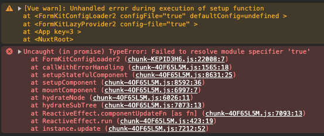

# FormKit/Nuxt Mystery Chunks

## Run it:

```
pnpm install
pnpm run dev
```

## What happens:

In the browser you’ll see:



This occurs when the `@formkit/vue` package did not pass through the vite transformation of the [unplugin-formkit](https://github.com/formkit/unplugin-formkit) package. Removing the checks in `transformInclude` resolves the issue (currently `unplugin-formkit@0.2.7` does this as a temporary fix, this repo has `0.2.6` installed explicitly to demonstrate the issue).